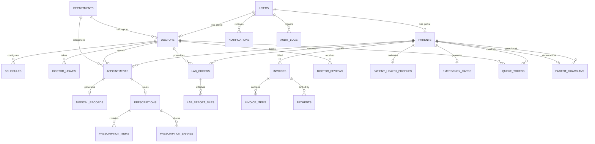

# Smart Hospital Management System (SHMS)

A full-stack, enterprise-grade hospital management web application built for modern healthcare facilities to streamline patient care, OPD queue management, family dependent profiles, emergency health cards, doctor scheduling, diagnostic lab workflows, billing, medical records, and AI-assisted health triage.

---

## 🌟 Tech Stack

- **Frontend**: React 19, Vite, Tailwind CSS v4, Lucide Icons, Recharts, React Query (`@tanstack/react-query`), React Hook Form, QR Code SVG (`qrcode.react`)
- **Backend**: Node.js, Express, PostgreSQL (`pg`), JWT Auth (Access & Refresh), Helmet, Express-Rate-Limit, PDFKit
- **Security**: Password hashing (`bcryptjs`), JWT Access/Refresh tokens, RBAC middleware, Acting-As guardian middleware, CORS restriction, Audit logging, Failed-login lockout, SQL parameterization
- **Testing**: Jest, Supertest

---

## 🏗️ Architecture Overview

The application follows a decoupled multi-tier architecture:
1. **Client Tier**: Single Page Application (SPA) built with React and Vite. Communicates with the backend REST API using Axios with automatic token refresh and `X-Acting-Patient-Id` context header interceptors.
2. **Application Tier**: Express.js REST API server handling request validation, authentication, authorization (RBAC), acting-as profile resolution, business logic, rate limiting, and PDF generation.
3. **Data Tier**: Relational PostgreSQL database storing user accounts, clinical records, doctor availability, financial transactions, lab results, OPD queue tokens, emergency cards, family guardians, and audit logs.

```
┌─────────────────────────┐        HTTP / REST API        ┌─────────────────────────┐
│ React 19 + Vite Client │ ◄────────────────────────────► │ Express.js REST Server  │
└─────────────────────────┘      (Bearer Access Token +   └────────────┬────────────┘
                                  X-Acting-Patient-Id)                 │ SQL Queries (pg)
                                                                       ▼
                                                          ┌─────────────────────────┐
                                                          │   PostgreSQL Database   │
                                                          └─────────────────────────┘
```

---

## 🗂️ Folder Structure

```
SHMS Project/
├── backend/
│   ├── scripts/               # Admin bootstrap, test DB setup, demo seeder
│   ├── src/
│   │   ├── config/            # Database, Cloudinary, Email, and JWT configuration
│   │   ├── controllers/       # Route request handlers
│   │   ├── middleware/        # Auth, RBAC, Acting-As, validation, rate limiting, upload handlers
│   │   ├── models/            # PostgreSQL data access models
│   │   ├── routes/            # Express route modules
│   │   ├── services/          # Email, PDF generation, AI triage, audit services
│   │   └── utils/             # Response formatters and helpers
│   ├── tests/                 # Jest & Supertest integration test suites
│   ├── uploads/               # Local file storage for records & lab reports
│   └── server.js              # Express app initialization & server entrypoint
├── database/                  # Schema definition and 15 ordered migration files
├── docs/                      # Production deployment documentation & audit report
└── frontend/                  # React 19 SPA source code
```

---

## 🛢️ Database Entity Relationship (ER) Diagram



---

## ⚡ Role-Based Features

### 👤 Patient Role
- **Auth & Profile**: Registration, login, profile edit, change password, view medical history.
- **My Family & Dependents**: Add and manage up to 5 family member profiles (children, parents, spouse, siblings). Switch acting profile context seamlessly across all patient pages via a persistent header banner.
- **Emergency Health Card**: Generate digital emergency card with QR code, blood group, allergies, chronic conditions, emergency contacts, and public access token. Printable wallet card format included.
- **OPD Token & Live Queue**: Same-day appointment check-in, live queue token card, real-time status tracking (Waiting, In Consultation, Completed), and estimated wait times.
- **Book Appointment**: Search doctors by department, select available time slots, and confirm appointments.
- **Appointments & History**: View upcoming and past appointments, cancel bookings, view status.
- **Clinical Records**: Access personal medical records, view diagnosis and treatment plans, download attached files.
- **Prescriptions & PDF**: View active prescriptions, download PDF prescriptions with QR verification code, time-limited share links, and digital doctor signature.
- **Lab Diagnostics**: Browse diagnostic lab test catalog, book lab test appointments, view results, and download report documents.
- **Billing & Payments**: View itemized invoices, download invoice PDFs, view payment receipts.
- **AI Health Assistant**: Interactive symptom checker and rule-based health triage guidance (informational only).

### 🩺 Doctor Role
- **Dashboard & Today's Queue**: Live OPD queue management console for calling next patient, marking in-consultation, completing, or skipping queue tokens.
- **Schedule Management**: Set weekly working hours, slot durations, max patient capacity, and request unavailability leaves with auto-rescheduling options.
- **Appointment Queue**: Approve, reject, complete, or reschedule patient appointments.
- **Clinical Operations**: Create patient medical records, upload diagnostic files, issue prescriptions with dosage/frequency details, and configure digital signature.
- **Lab Orders**: Prescribe diagnostic lab tests for patients and review lab results.
- **Doctor Profile & Reviews**: Manage bio, qualifications, consultation fee, upload signature, and view patient ratings/feedback.
- **Invoices View**: Track patient consultation invoices and billing status.

### 🛡️ Admin Role
- **Hospital Operations**: Manage departments, doctor profiles, registration numbers, fees, and availability.
- **User Management**: View user accounts, change user roles, activate/deactivate accounts, unlock locked accounts.
- **Live OPD Queue Board**: Real-time hospital-wide queue monitoring board displaying live queue status per department and doctor.
- **Analytics & Revenue**: View hospital overview stats, appointment trends, revenue charts, department performance, and export CSV reports.
- **Security & Audits**: Inspect real-time security audit logs, failed login tracking, login history, and system configurations.

---

## 🔌 Main API Endpoints

| Method | Endpoint Path | Access Role | Description |
|---|---|---|---|
| `GET` | `/api/health` | Public | System health status & database connectivity check |
| `POST` | `/api/v1/auth/register` | Public | Register new patient account |
| `POST` | `/api/v1/auth/login` | Public | User login & token generation |
| `POST` | `/api/v1/auth/refresh-token` | Public | Refresh expired access token |
| `GET` | `/api/v1/departments` | Public / All | List active hospital departments |
| `GET` | `/api/v1/doctors` | Public / All | List doctors with filter by department |
| `GET` | `/api/v1/doctors/:id` | Public / All | Public doctor profile, ratings, and schedule |
| `GET` | `/api/v1/appointments/slots` | Authenticated | Get available doctor slots for a date |
| `POST` | `/api/v1/appointments` | Patient | Book new appointment (supports acting-as context) |
| `GET` | `/api/v1/appointments/my` | Patient | List patient appointments (supports acting-as) |
| `PATCH` | `/api/v1/appointments/:id/approve` | Doctor, Admin | Approve pending appointment |
| `GET` | `/api/v1/medical-records/my` | Patient | Get patient's medical records (supports acting-as) |
| `POST` | `/api/v1/medical-records` | Doctor, Admin | Create new patient medical record |
| `GET` | `/api/v1/prescriptions/my` | Patient | Get patient prescriptions (supports acting-as) |
| `GET` | `/api/v1/prescriptions/:id/pdf` | Authenticated | Download prescription PDF |
| `GET` | `/api/v1/prescriptions/verify/:code` | Public (Limited) | Verify prescription by QR verification code |
| `GET` | `/api/v1/prescriptions/shared/:token` | Public (Limited) | Access shared prescription via time-limited link |
| `GET` | `/api/v1/emergency-card/me` | Patient | Get patient emergency card details |
| `GET` | `/api/v1/emergency-card/public/:token` | Public (Limited) | Access public emergency card view |
| `POST` | `/api/v1/queue/check-in` | Patient | Check in for today's appointment & get queue token |
| `GET` | `/api/v1/queue/my-token` | Patient | Get active queue token status |
| `GET` | `/api/v1/queue/doctor/today` | Doctor, Admin | Get doctor's OPD queue for today |
| `POST` | `/api/v1/queue/call-next` | Doctor | Call next waiting patient in OPD queue |
| `GET` | `/api/v1/queue/board` | Admin | Get live hospital OPD queue board data |
| `GET` | `/api/v1/family` | Patient | List guardian's dependent family members |
| `POST` | `/api/v1/family` | Patient | Add new dependent family member (Max 5) |
| `PUT` | `/api/v1/family/:id` | Patient | Edit dependent family member details |
| `DELETE` | `/api/v1/family/:id` | Patient | Deactivate dependent family member profile |
| `GET` | `/api/v1/lab/orders/my` | Patient | Get patient's lab orders (supports acting-as) |
| `POST` | `/api/v1/lab/orders/book` | Patient | Book lab test for patient |
| `GET` | `/api/v1/invoices/my` | Patient | Get patient invoices (supports acting-as) |
| `POST` | `/api/v1/invoices` | Admin | Create new itemized invoice |
| `POST` | `/api/v1/invoices/:id/payments` | Admin | Record payment for invoice |
| `GET` | `/api/v1/analytics/overview` | Admin | System analytics summary |
| `POST` | `/api/v1/ai/analyze` | Authenticated | Submit symptom text for AI triage analysis |
| `GET` | `/api/v1/admin/audit-logs` | Admin | Security audit trail logs |

---

## 🔑 Environment Variables

| Variable | Purpose | Required / Optional | Scope |
|---|---|---|---|
| `NODE_ENV` | Application environment (`development`, `test`, `production`) | Required | Backend |
| `PORT` | Backend HTTP server listening port | Required | Backend |
| `DB_HOST` | PostgreSQL host address | Required | Backend |
| `DB_PORT` | PostgreSQL port | Required | Backend |
| `DB_NAME` | Main PostgreSQL database name | Required | Backend |
| `DB_USER` | Database user name | Required | Backend |
| `DB_PASSWORD` | Database password | Required | Backend |
| `DB_SSL` | Enable SSL for database connection (`true`/`false`) | Optional | Backend |
| `JWT_ACCESS_SECRET` | Secret key for signing short-lived access tokens | Required | Backend |
| `JWT_REFRESH_SECRET` | Secret key for signing long-lived refresh tokens | Required | Backend |
| `JWT_ACCESS_EXPIRES` | Expiration time for access token (e.g. `15m`) | Optional | Backend |
| `JWT_REFRESH_EXPIRES` | Expiration time for refresh token (e.g. `7d`) | Optional | Backend |
| `FRONTEND_URL` | Frontend URL allowed by CORS middleware | Required | Backend |
| `CLOUDINARY_CLOUD_NAME` | Cloudinary cloud name for file storage | Optional | Backend |
| `CLOUDINARY_API_KEY` | Cloudinary API key | Optional | Backend |
| `CLOUDINARY_API_SECRET` | Cloudinary API secret | Optional | Backend |
| `EMAIL_HOST` | Nodemailer SMTP host | Optional | Backend |
| `EMAIL_PORT` | Nodemailer SMTP port | Optional | Backend |
| `EMAIL_USER` | Nodemailer SMTP user | Optional | Backend |
| `EMAIL_PASS` | Nodemailer SMTP password | Optional | Backend |
| `ENABLE_CRON` | Enable cron job reminders (`true`/`false`) | Optional | Backend |
| `AI_PROVIDER_KEY` | API Key for AI provider service | Optional | Backend |
| `AI_MODEL` | AI Model identifier | Optional | Backend |
| `VITE_API_URL` | Frontend API base URL | Required | Frontend |
| `VITE_APP_NAME` | Frontend Application Name | Optional | Frontend |
| `VITE_SHOW_DEMO` | Toggle demo credentials box on login page (`true`/`false`) | Optional | Frontend |

---

## 💻 Local Setup Instructions (Windows)

1. **Prerequisites**: Node.js v18+, PostgreSQL v14+ installed and running, pgAdmin 4.
2. **Create Database in pgAdmin**:
   - Open pgAdmin 4, connect to your local PostgreSQL server.
   - Right-click **Databases** -> **Create** -> **Database...**
   - Set Database Name: `shms_db`.
3. **Execute Migrations**:
   - Open Query Tool on `shms_db` in pgAdmin.
   - Execute all 15 SQL files in `database/` in sequential order:
     `schema.sql` -> `migration_phase2...` -> ... -> `migration_phase14_4...`
4. **Configure Environment Variables**:
   - Copy `backend/.env.example` to `backend/.env` and update DB credentials if necessary.
   - Copy `frontend/.env.example` to `frontend/.env`.
5. **Seed Demo Data**:
   ```bash
   node backend/scripts/seedDemo.js
   ```
6. **Start Backend Server**:
   ```bash
   cd backend
   npm run dev
   ```
7. **Start Frontend Client**:
   ```bash
   cd frontend
   npm run dev
   ```
8. Access application at `http://localhost:5173`.

---

## 🧪 How to Run Tests

Backend integration tests run against an isolated test database (`shms_test`):

1. **Create Empty Test Database**:
   - In pgAdmin, create a database named `shms_test`.
2. **Run Test Database Setup**:
   ```bash
   node backend/scripts/setupTestDb.js
   ```
3. **Execute Test Suite**:
   ```bash
   cd backend
   npm test
   ```

---

## 🔑 Demo Accounts

> [!WARNING]
> These demo accounts are intended **strictly for local development and testing**. Change or remove them before any public deployment.

- **Admin Account**: `admin@shms.com` / `Admin@123456`
- **Doctor Account**: `doctor.patel@example.com` / `Doctor@123456` (Cardiology OPD Target)
- **Doctor Account**: `doctor.smith@example.com` / `Doctor@123456` (General Medicine)
- **Patient Account**: `john.doe@example.com` / `Patient@123456` (Emergency Card & OPD)
- **Patient Account**: `sarah.connor@example.com` / `Patient@123456` (Family Profiles & Switcher)

---

## 🚀 Deployment (Vercel + Render)

- **Frontend**: Deployed on Vercel. `frontend/vercel.json` rewrites `/api/*` to the Render backend so all API calls are same-origin (no CORS issues) and falls back to the `VITE_API_URL` env var for direct calls.
- **Backend**: Deployed on Render (Node/Express). Important env vars: `NODE_ENV=production`, `FRONTEND_URL=<your-vercel-site-url>` (CORS allow-list), `DB_*` Neon/Postgres credentials, `DB_SSL=true`.
- **Migrations in production**:
  ```bash
  $env:DATABASE_URL="<postgres-connection-string>"; $env:DB_SSL="true"
  node backend/scripts/migrate.js --yes
  ```
- A live demo runs at `https://shms-project-ecru.vercel.app/` backed by the Render service `shms-backend`.

---

## 🎬 Demo Script & 3-Minute Video Flow

> [!CAUTION]
> **NEVER run the demo seed script on a public or production deployment.** It is built exclusively for local development, demonstration videos, and testing.

### Command to Seed Demo Data
To populate a complete, realistic demonstration dataset across all modules (including OPD Queue, Emergency Card, and Family Dependents):

```bash
node backend/scripts/seedDemo.js
```

### 10-Step Video Demonstration Flow (3-Minute Walkthrough)

1. **Patient Login**: Log in as patient John Doe (`john.doe@example.com` / `Patient@123456`).
2. **Book Appointment**: Search for Dr. Aisha Patel in Cardiology and book a consultation slot.
3. **Doctor Approval**: Switch login to Dr. Aisha Patel (`doctor.patel@example.com` / `Doctor@123456`) and approve the appointment request.
4. **OPD Check-in**: Log back in as John Doe, open **My Appointments**, click **Check-in Today**, and receive a live OPD queue token.
5. **OPD Live Queue Calling**: Switch to Dr. Patel, open **Today's Queue**, and click **Call Next Patient** to call John Doe's token into consultation.
6. **Clinical Consultation & Prescription**: Create medical record diagnosis, add prescribed medicines, and generate prescription with digital signature and QR verification code.
7. **Billing & Invoice Settlement**: Log in as Admin (`admin@shms.com` / `Admin@123456`), open **Billing**, inspect itemized invoice, and record payment settlement.
8. **Emergency Health Card**: Log back in as John Doe, open **Emergency Card**, preview QR code, and open the public token link in an incognito window.
9. **Family & Dependents**: Log in as patient Sarah Connor (`sarah.connor@example.com` / `Patient@123456`) and open **My Family** to view dependent profiles (Leo & Mary).
10. **Profile Context Switcher**: Click **Switch to Profile** in the header profile switcher or family page, observe the persistent amber management banner, and view dependent child Leo's appointment schedule.

---

## 📸 Screen Capture Checklist (Screenshots)

When generating presentation documentation or screenshots, capture the following screens:
1. `01-login-screen.png`: Login page showing dark mode glassmorphism UI and demo credentials toggle.
2. `02-patient-dashboard.png`: Patient overview panel with upcoming appointments and quick actions.
3. `03-patient-family.png`: My Family & Dependents page showing dependent cards and acting-as banner.
4. `04-emergency-card.png`: Patient Emergency Health Card page with QR code, medical alerts, and print view.
5. `05-public-emergency-card.png`: Public emergency card view for first responders.
6. `06-book-appointment.png`: Slot selection and doctor booking form.
7. `07-patient-opd-token.png`: Patient check-in card showing live token status and queue counter.
8. `08-doctor-today-queue.png`: Doctor's Today Queue console with patient calling action buttons.
9. `09-admin-queue-board.png`: Live hospital OPD Queue Board monitoring department statuses.
10. `10-doctor-profile.png`: Doctor specialization, schedule, and patient reviews.
11. `11-prescription-pdf.png`: Generated prescription PDF with QR verification code and digital signature.
12. `12-lab-report-viewer.png`: Diagnostic lab test catalog and report file viewer.
13. `13-billing-invoice.png`: Itemized invoice details and payment modal.
14. `14-admin-analytics.png`: Hospital revenue charts, appointment trends, and stats.
15. `15-ai-health-assistant.png`: Interactive AI triage and symptom checker interface.
16. `16-mobile-responsive.png`: Mobile viewpoint showing bottom navigation bar and drawer menu.

---

## ⚠️ Known Limitations & Future Work

1. **Local File Storage**: Medical uploads and lab report PDFs are stored on local disk (`backend/uploads/`). On free serverless/ephemeral hosts, local files are wiped on restart. Cloudinary integration is configured as an optional fallback.
2. **Manual Payment Recording**: Invoices record manual payments (Cash/UPI/Card). Integration with real payment gateways (Stripe/Razorpay) is an architectural extension point.
3. **Email SMTP Setup**: Email notifications require valid SMTP credentials in `.env`. Mocks are used when unconfigured.
4. **AI Assistant Scope**: The AI Health Assistant provides rule-based informational triage guidance only and does NOT make clinical diagnoses.
5. **Lab Reference Ranges**: Lab test reference values are provided as standardized sample ranges.
6. **Queue Wait Time Estimates**: OPD queue wait times are estimated based on standard 15-minute slot averages.
7. **Emergency Card Public Token Access**: The emergency card is visible to anyone with the QR/token link until the patient regenerates or disables the public token.
8. **Family Feature Acting-As Scope**: The acting-as context (`X-Acting-Patient-Id`) applies across patient routes (appointments, medical records, prescriptions, lab tests, billing, queue). Profile setting edits remain bound to the primary account user.
9. **Ideas for Future Work**:
   - Waitlist management for booked-out doctors
   - Patient vitals tracker (Blood Pressure, Pulse, Blood Sugar)
   - Multilingual / Hindi language toggle
   - Video tele-consultation integration
   - Real payment gateway integration (Razorpay / Stripe webhooks)

---

## 🛡️ Security Notes

- **Secrets Sanitization**: Secrets, password hashes, and tokens are never printed in logs or sent in API error responses.
- **Rate Limiting**: Express rate limiters protect login endpoints from brute-force attempts.
- **Input Sanitization**: PostgreSQL queries utilize strict parameterization (`$1, $2`) to prevent SQL injection.
- **Audit Trail**: Sensitive actions (payments, record access, profile edits, acting-as requests) are logged to `audit_logs`.
