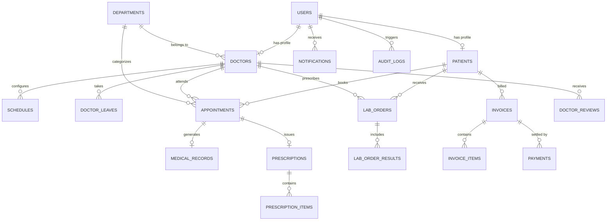

# Smart Hospital Management System (SHMS)

A full-stack, enterprise-grade hospital management web application designed for healthcare facilities to streamline patient care, doctor schedules, diagnostic lab workflows, billing, medical records, and AI-assisted health triage.

---

## 🌟 Tech Stack

- **Frontend**: React 19, Vite, Tailwind CSS v4, Lucide Icons, Recharts, React Query, React Hook Form
- **Backend**: Node.js, Express, PostgreSQL (`pg`), JWT Auth, Helmet, Express-Rate-Limit, PDFKit
- **Security**: Password hashing (bcryptjs), JWT Access/Refresh tokens, RBAC middleware, CORS restriction, Audit logging, Failed-login lockout, SQL parameterization
- **Testing**: Jest, Supertest

---

## 🏗️ Architecture Overview

The application follows a decoupled multi-tier architecture:
1. **Client Tier**: Single Page Application (SPA) built with React and Vite. Communicates with backend REST API using Axios with automatic token refresh interceptors.
2. **Application Tier**: Express.js REST API server handling request validation, authentication, authorization (RBAC), business logic, rate limiting, and PDF generation.
3. **Data Tier**: Relational PostgreSQL database storing user accounts, clinical records, doctor availability, financial transactions, lab results, and audit logs.

```
┌─────────────────────────┐        HTTP / REST API        ┌─────────────────────────┐
│ React 19 + Vite Client │ ◄────────────────────────────► │ Express.js REST Server  │
└─────────────────────────┘      (Bearer Access Token)    └────────────┬────────────┘
                                                                       │ SQL Queries (pg)
                                                                       ▼
                                                          ┌─────────────────────────┐
                                                          │   PostgreSQL Database   │
                                                          └─────────────────────────┘
```

---

## 🗂️ Folder Structure

```
SHMS Project/
├── backend/
│   ├── scripts/               # Admin bootstrap, test DB setup, demo seeder
│   ├── src/
│   │   ├── config/            # Database and JWT configuration
│   │   ├── controllers/       # Route request handlers
│   │   ├── middleware/        # Auth, RBAC, validation, rate limiting, upload handlers
│   │   ├── models/            # PostgreSQL data access models
│   │   ├── routes/            # Express route modules
│   │   ├── services/          # Email, PDF generation, AI triage, audit services
│   │   └── utils/             # Response formatters and helpers
│   ├── tests/                 # Jest & Supertest integration test suites
│   ├── uploads/               # Local file storage for records & lab reports
│   └── server.js              # Express app initialization & server entrypoint
├── database/                  # Schema definition and ordered migration files
├── docs/                      # Production deployment documentation
└── frontend/                  # React 19 SPA source code
```

---

## 🛢️ Database Entity Relationship (ER) Diagram



---

## ⚡ Role-Based Features

### 👤 Patient Role
- **Auth & Profile**: Registration, login, profile edit, change password, view medical history.
- **Appointments**: View available doctor slots, book appointments, cancel bookings, view booking status.
- **Clinical Records**: Access personal medical records, view prescriptions, download PDF prescriptions.
- **Lab Diagnostics**: View ordered lab tests, download lab report documents.
- **Billing & Payments**: View itemized invoices, download invoice PDFs, view payment receipts.
- **AI Assistant**: Interactive symptom checker and health triage guidance (informational only).

### 🩺 Doctor Role
- **Schedule Management**: Set weekly working hours, slot durations, max patient capacity, and request leaves.
- **Appointment Queue**: Approve, reject, complete, or reschedule patient appointments.
- **Clinical Operations**: Create patient medical records, upload diagnostic files, issue prescriptions with dosage details.
- **Lab Orders**: Prescribe diagnostic lab tests for patients and review lab results.
- **Billing View**: Track patient consultation invoices and billing history.

### 🛡️ Admin Role
- **Hospital Operations**: Manage departments, doctor profiles, registration numbers, and availability.
- **User Management**: View user accounts, change user roles, activate/deactivate accounts.
- **Analytics & Revenue**: View hospital overview stats, appointment trends, revenue charts, export CSV reports.
- **Security & Audits**: Inspect real-time audit logs, failed login attempts, and system configuration.

---

## 🔌 Main API Endpoints

| Method | Endpoint Path | Access Role | Description |
|---|---|---|---|
| `GET` | `/api/health` | Public | System health status & DB status check |
| `POST` | `/api/v1/auth/register` | Public | Register new patient account |
| `POST` | `/api/v1/auth/login` | Public | User login & token generation |
| `POST` | `/api/v1/auth/refresh-token` | Public | Refresh expired access token |
| `GET` | `/api/v1/departments` | Public / All | List active hospital departments |
| `GET` | `/api/v1/doctors` | Public / All | List doctors with filter by department |
| `GET` | `/api/v1/appointments/slots` | Authenticated | Get available doctor slots |
| `POST` | `/api/v1/appointments` | Patient | Book new appointment |
| `PATCH` | `/api/v1/appointments/:id/approve` | Doctor, Admin | Approve pending appointment |
| `GET` | `/api/v1/medical-records/my` | Patient | Get patient's medical records |
| `POST` | `/api/v1/medical-records` | Doctor, Admin | Create new patient medical record |
| `GET` | `/api/v1/prescriptions/:id/pdf` | Authenticated | Download prescription PDF |
| `GET` | `/api/v1/lab/orders/my` | Patient | Get patient's lab orders |
| `POST` | `/api/v1/lab/orders` | Doctor, Admin | Create lab order for patient |
| `GET` | `/api/v1/invoices/my` | Patient | Get patient invoices |
| `POST` | `/api/v1/invoices` | Admin | Create new itemized invoice |
| `POST` | `/api/v1/invoices/:id/payments` | Admin | Record payment for invoice |
| `GET` | `/api/v1/analytics/overview` | Admin | System analytics summary |
| `GET` | `/api/v1/admin/audit-logs` | Admin | Security audit trail logs |

---

## 🔑 Environment Variables

| Variable | Purpose | Required / Optional |
|---|---|---|
| `NODE_ENV` | Application environment (`development`, `test`, `production`) | Required |
| `PORT` | Backend HTTP server listening port | Required |
| `DB_HOST` | PostgreSQL host address | Required |
| `DB_PORT` | PostgreSQL port | Required |
| `DB_NAME` | Main PostgreSQL database name | Required |
| `DB_USER` | Database user name | Required |
| `DB_PASSWORD` | Database password | Required |
| `DB_SSL` | Enable SSL for database connection (`true`/`false`) | Optional |
| `JWT_ACCESS_SECRET` | Secret key for signing short-lived access tokens | Required |
| `JWT_REFRESH_SECRET` | Secret key for signing long-lived refresh tokens | Required |
| `FRONTEND_URL` | Frontend URL allowed by CORS middleware | Required |
| `RATE_LIMIT_LOGIN_MAX` | Max allowed login attempts per IP per window | Optional |
| `VITE_API_URL` | Frontend API base URL | Required (Frontend) |
| `VITE_SHOW_DEMO` | Toggle demo credentials box on login page | Optional (Frontend) |

---

## 💻 Local Setup Instructions (Windows)

1. **Prerequisites**: Node.js v18+, PostgreSQL v14+ installed and running, pgAdmin 4.
2. **Create Database in pgAdmin**:
   - Open pgAdmin 4, connect to your local PostgreSQL server.
   - Right-click **Databases** -> **Create** -> **Database...**
   - Set Database Name: `shms_db`.
3. **Execute Migrations**:
   - Open Query Tool on `shms_db` in pgAdmin.
   - Execute SQL files in `database/` in sequential order:
     `schema.sql` -> `migration_phase2...` -> ... -> `migration_phase11...`
4. **Configure Environment Variables**:
   - Copy `backend/.env.example` to `backend/.env` and update DB credentials if necessary.
   - Copy `frontend/.env.example` to `frontend/.env`.
5. **Seed Demo Data**:
   ```bash
   node backend/scripts/seedDemo.js
   ```
6. **Start Backend Server**:
   ```bash
   cd backend
   npm run dev
   ```
7. **Start Frontend Client**:
   ```bash
   cd frontend
   npm run dev
   ```
8. Access application at `http://localhost:5173`.

---

## 🧪 How to Run Tests

Backend integration tests run against an isolated test database (`shms_test`):

1. **Create Empty Test Database**:
   - In pgAdmin, create a database named `shms_test`.
2. **Run Test Database Setup**:
   ```bash
   node backend/scripts/setupTestDb.js
   ```
3. **Execute Test Suite**:
   ```bash
   cd backend
   npm test
   ```

---

## 🔑 Demo Accounts

> [!WARNING]
> These demo accounts are intended **strictly for local development and testing**.

- **Admin Account**: `admin@shms.com` / `Admin@123456`
- **Doctor Account**: `doctor.smith@example.com` / `Doctor@123456`
- **Patient Account**: `john.doe@example.com` / `Patient@123456`

---

## 📸 Screen Capture Checklist (Screenshots)

When generating presentation documentation or screenshots, capture the following screens:
1. `01-login-screen.png`: Login page showing dark mode glassmorphism UI.
2. `02-patient-dashboard.png`: Patient overview panel with upcoming appointments.
3. `03-book-appointment.png`: Slot selection and doctor booking form.
4. `04-doctor-profile.png`: Doctor specialization, schedule, and patient reviews.
5. `05-admin-analytics.png`: Hospital revenue charts, appointment trends, and stats.
6. `06-prescription-pdf.png`: Generated prescription document preview.
7. `07-lab-report-viewer.png`: Diagnostic lab test results and status.
8. `08-billing-invoice.png`: Itemized invoice details and payment modal.
9. `09-mobile-responsive.png`: Mobile viewpoint navigation and layout.
10. `10-security-audit-page.png`: Admin security logs and failed login tracking.

---

## ⚠️ Known Limitations & Future Work

1. **Local File Storage**: Medical uploads and lab report PDFs are stored on local disk (`backend/uploads/`). On free serverless/ephemeral hosts, local files are wiped on restart. AWS S3 / Cloudinary integration is recommended for production.
2. **Manual Payment Gateways**: Invoices record manual payments (Cash/UPI/Card). Integration with Stripe/Razorpay webhooks is an architectural extension point.
3. **Email SMTP Setup**: Email notifications require valid SMTP credentials in `.env`. Mocks are used when unconfigured.
4. **AI Assistant Scope**: The AI Health Assistant provides rule-based informational triage guidance only and does NOT make clinical diagnoses.
5. **Lab Reference Ranges**: Lab test reference values are provided as standardized sample ranges.

---

## 🛡️ Security Notes

- **Secrets Sanitization**: Secrets, password hashes, and tokens are never printed in logs or sent in API error responses.
- **Rate Limiting**: Express rate limiters protect login endpoints from brute-force attempts.
- **Input Sanitization**: PostgreSQL queries utilize strict parameterization (`$1, $2`) to prevent SQL injection.
- **Audit Trail**: Sensitive actions (payments, record access, profile edits) are logged to `audit_logs`.
